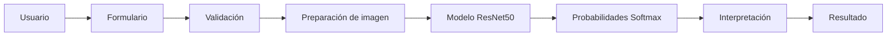

# Documentación técnica — Inspector solar

## 1. Objetivo

Inspector solar integra un clasificador ResNet50 en una aplicación Django para identificar una de seis condiciones visibles en fotografías de paneles fotovoltaicos. La solución prioriza separación de responsabilidades, validación de entradas, resultados interpretables y ejecución reproducible con fines académicos.

## 2. Arquitectura general

La aplicación se divide en cuatro capas:

1. **Presentación:** plantillas HTML, CSS, JavaScript y SVG local.
2. **Aplicación web:** URLs y vistas Django.
3. **Validación e inferencia:** formulario y `ModelService`.
4. **Artefactos:** modelo `.keras`, nombres de clases y resultados del entrenamiento.

No existe persistencia de imágenes o predicciones. El archivo SQLite solo contiene las tablas iniciales de Django.

## 3. Patrón MVT

Django utiliza Model–View–Template:

- **Model:** no se definen modelos de negocio porque esta versión no guarda datos.
- **View:** coordina solicitudes HTTP, formularios, inferencia y contexto de respuesta.
- **Template:** transforma el contexto en HTML escapado por Django.

El formulario y el servicio de inferencia complementan MVT al aislar validaciones y operaciones de aprendizaje automático.

## 4. Responsabilidades de los componentes

### `predictor/forms.py`

- Declara `ImageUploadForm` con un `ImageField`.
- Rechaza archivos ausentes, vacíos o mayores de 10 MB antes de decodificarlos.
- Verifica contenido real mediante Pillow.
- Comprueba extensión y correspondencia con JPEG, PNG o WEBP.
- Limita dimensiones a 10 000 píxeles por lado y 40 megapíxeles.
- Acepta, entre otros modos compatibles, RGB, RGBA y escala de grises.

### `predictor/views.py`

- `home`: presenta el formulario.
- `analyze`: valida, genera una vista previa y solicita la predicción.
- `model_info`: lee configuración y reporte de clasificación.
- `model_result_image`: sirve únicamente los dos gráficos incluidos en una lista cerrada.
- Captura errores técnicos y muestra mensajes generales en español.

### `predictor/urls.py`

Define las rutas con nombres estables:

- `predictor:home` → `/`
- `predictor:analyze` → `/analizar/`
- `predictor:model_info` → `/modelo/`
- `predictor:model_result_image` → gráficos permitidos

### `predictor/services/model_service.py`

- Resuelve rutas desde `settings.BASE_DIR`.
- Valida `class_names.json` y su orden exacto.
- Carga el modelo mediante `tf.keras.models.load_model(..., compile=False)`.
- Verifica entrada `(None, 224, 224, 3)` y salida `(None, 6)`.
- Prepara imágenes y ejecuta inferencia.
- Valida y ordena probabilidades.
- Asocia clases técnicas con nombres, descripciones y recomendaciones.

### `templates/`

- `base.html`: navegación, estructura común y pie institucional.
- `predictor/home.html`: presentación y formulario.
- `predictor/result.html`: resultado y probabilidades.
- `predictor/model_info.html`: arquitectura, métricas y gráficos.

Django escapa las variables de plantilla por defecto. La vista previa base64 se construye en el servidor a partir de bytes JPEG controlados.

### `static/`

- `styles.css`: sistema visual, estados, accesibilidad y breakpoints.
- `upload.js`: carga, arrastre, vista previa, menú, animaciones y prevención de doble envío.
- `solar-mark.svg`: identidad gráfica local.

No se cargan librerías, fuentes, gráficos ni scripts externos.

## 5. Flujo desde la carga hasta el resultado

1. El navegador envía un formulario `multipart/form-data` protegido por CSRF.
2. `ImageUploadForm` valida metadatos y contenido real.
3. La vista genera una vista previa JPEG reducida en memoria.
4. `ModelService.prepare_image` abre nuevamente el archivo validado.
5. Se corrige EXIF, se convierte a RGB y luego a `float32`.
6. TensorFlow redimensiona y crea el lote `(1, 224, 224, 3)`.
7. El singleton carga o reutiliza el modelo.
8. `model.predict(..., verbose=0)` devuelve la salida Softmax.
9. Se valida la distribución y se identifica `argmax`.
10. La plantilla muestra el resultado sin guardar la imagen.

## 6. Validación de imágenes

La validación aplica defensa en profundidad:

- `LimitedImageField` comprueba vacío y tamaño antes de Pillow.
- `ImageField` comprueba que el archivo pueda interpretarse como imagen.
- `clean_image` vuelve a verificar el contenido completo con `verify()` y `load()`.
- La extensión debe corresponder con el formato detectado.
- Las advertencias de imágenes desproporcionadamente grandes se convierten en errores.
- El puntero se restablece con `seek(0)` antes de entregar el archivo a la vista.

Los errores internos de Pillow no se muestran al usuario.

## 7. Preprocesamiento

El servicio externo realiza exclusivamente:

1. `Image.open`.
2. `ImageOps.exif_transpose`.
3. Conversión a RGB.
4. Conversión a arreglo NumPy `float32`.
5. Redimensionamiento a `224 × 224`.
6. Dimensión de lote.
7. Verificación del rango 0–255.

**Importante:** el archivo `best_resnet50_paneles_6clases.keras` ya contiene internamente aumento de datos, conversión RGB→BGR, `preprocess_input` de ResNet50 y resta de medias de ImageNet. Por ello Django no normaliza, no divide entre 255, no llama a `preprocess_input`, no cambia canales a BGR y no aplica aumento de datos.

Duplicar estas operaciones modificaría la distribución esperada por el modelo y produciría inferencias incorrectas.

## 8. Carga diferida y singleton

`get_model_service` usa `functools.lru_cache(maxsize=1)` para devolver una única instancia por proceso. Dentro del servicio, `_ensure_loaded` usa comprobación doble y `threading.Lock`:

- La importación de la aplicación no carga 216 MB inmediatamente.
- La primera inferencia o consulta de forma carga el modelo.
- Solicitudes posteriores reutilizan la instancia.
- El candado evita cargas simultáneas duplicadas en un mismo proceso.

En un despliegue con varios procesos, cada proceso mantiene su propia copia; esta aplicación no configura despliegue en la fase académica.

## 9. Predicción Softmax

La capa final devuelve seis valores no negativos que representan una distribución Softmax. El servicio exige:

- Forma exacta `(6,)` después de retirar el lote.
- Todos los valores finitos.
- Ningún valor negativo.
- Suma aproximadamente igual a uno con tolerancia numérica.

Softmax expresa preferencia relativa entre clases, pero no garantiza calibración probabilística.

## 10. Relación entre índices y clases

| Índice | Clase |
|---:|---|
| 0 | `Bird-drop` |
| 1 | `Clean` |
| 2 | `Dusty` |
| 3 | `Electrical-damage` |
| 4 | `Physical-Damage` |
| 5 | `Snow-Covered` |

El contenido de `ml_models/class_names.json` debe coincidir exactamente. La clase principal se obtiene mediante `numpy.argmax` y se relaciona por índice, sin reordenar la salida original.

## 11. Cálculo de confianza

La confianza es el valor Softmax de la clase principal. Las etiquetas de interfaz son reglas de presentación:

- Alta: `confidence >= 0.75`.
- Moderada: `0.60 <= confidence < 0.75`.
- Baja: `confidence < 0.60`.

Estos umbrales no constituyen una calibración científica.

## 12. Presentación de probabilidades

Las seis probabilidades se ordenan de mayor a menor después de determinar la clase principal. Cada registro conserva:

- Clase técnica.
- Nombre en español.
- Probabilidad sin redondear.
- Porcentaje.
- Valor de barra limitado entre 0 y 100.
- Indicador de ganador.

El redondeo ocurre únicamente al renderizar. JavaScript vuelve a limitar el valor del atributo antes de animar el elemento `<progress>`.

## 13. Manejo de errores

- `ModelIntegrationError` representa fallos controlados de archivos, formas, píxeles o probabilidades.
- TensorFlow y Pillow quedan encapsulados para evitar detalles internos en HTML.
- La vista registra el evento técnico y agrega un error general al formulario.
- La página del modelo muestra un mensaje controlado si no puede leer resultados.
- Los gráficos desconocidos responden HTTP 404.

## 14. Seguridad

- CSRF en el POST de análisis.
- Validación real del archivo, tamaño y dimensiones.
- Lista cerrada para gráficos; el usuario no proporciona rutas de archivos.
- Rutas calculadas desde `BASE_DIR`.
- Plantillas con autoescapado de Django.
- Nombre del archivo insertado en JavaScript mediante `textContent`, no `innerHTML`.
- Vista previa generada como JPEG base64 con tamaño máximo de 1200 × 900.
- Sin escritura en `media/`, temporales propios o base de datos.
- Sin APIs externas, analítica ni cookies adicionales a las de Django.

## 15. Pruebas

`predictor/tests.py` cubre formularios, modos de imagen, límites, preparación, interpretación, vistas, rutas, métricas y estáticos. Las vistas simulan el servicio para no cargar repetidamente el modelo.

`predictor/test_model_integration.py` permanece desactivado por defecto y se ejecuta con `RUN_MODEL_INTEGRATION_TESTS=1`. `check_model` proporciona otra comprobación real e independiente.

Consultar [PRUEBAS.md](PRUEBAS.md) para la matriz completa.

## 16. Limitaciones

- Clasificación global, no detección ni segmentación.
- Seis clases cerradas; no existe una clase “desconocida”.
- Sensibilidad a iluminación, enfoque, ángulo y contexto.
- Dataset limitado a 869 imágenes.
- Exactitud de prueba de 77.54% y pérdida de 0.6749.
- Softmax puede mostrar confianza alta aun ante imágenes fuera de distribución.
- No se evalúa estado eléctrico real ni se emiten diagnósticos profesionales.
